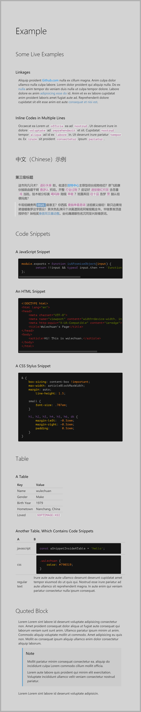

<link rel="stylesheet" href="./dist/markdown-styles-for-vscode-built-in-preview.min.css">

# Introduction

This is a collection of themes that each
can be applied to shade any `Markdown` generated `HTML` contents.


# Usage


## Offline Usage

For offline usage, like working with Microsft [Visual Studio Code](https://code.visualstudio.com),
it's as easy as adding a markup inside your `Markdown` files, like so:

```md
<link rel="stylesheet" href="path/to/markdown-styles-for-vscode-built-in-preview.min.css">
```


## Online Usage

Currently, there is **no** way
that we can insert customer stylesheets into markdown pages in `github.com` or `bitbucket.org`.

See <https://github.com/github/markup> for a reference.

> 2. The HTML is sanitized, aggressively removing things
>    that could harm you and your kin—such as
>   `script` tags, `inline-styles`, and `class` or `id` attributes.
>    See the sanitization filter for the full whitelist.


# Example

Below is a snapshot of the rendered look of an `.md` file,
inside Microsoft Visual Studio Code,
rendered by the built-in markdown preview tool.




<style type="text/css">
</style>